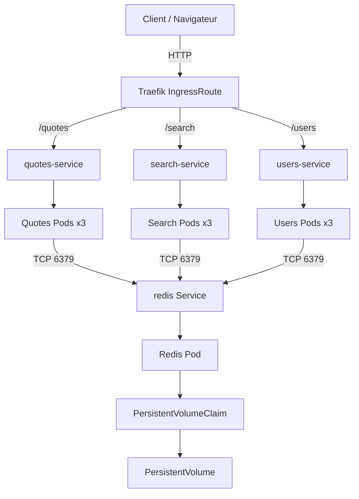

[](https://classroom.github.com/a/GT-wEZl_)
# iut-stmalo-sae503
Application Python de gestion des citations du capitaine Haddock, utilisée dans le cadre de la SAÉ 5.03. Ce code est strictement destiné à des fins pédagogiques.

# Architecture du repo

```bash
├── citations-haddock-app.yml # manifeste Kubernetes
├── citations_haddock.py # application original
├── quotes # service quotes
│   ├── app.py
│   ├── Dockerfile # build l'image docker quotes
│   ├── initial_data_quotes.csv
│   └── requirements.txt
├── search # service search
│   ├── app.py
│   ├── Dockerfile # build de l'image docker search
│   └── requirements.txt
└── users # service users
    ├── app.py
    ├── Dockerfile # build de l'image docker users
    ├── initial_data_users.csv
    └── requirements.txt
```

# Shema d'architecture



# Deploiment

## dev

```bash
kubectl create namespace citations-haddock-dev
kubectl -n citations-haddock-dev apply -f citations-haddock-app.yml
```

## prod

```bash
kubectl create namespace citations-haddock-prod
kubectl -n citations-haddock-prod apply -f citations-haddock-prod.yml
```